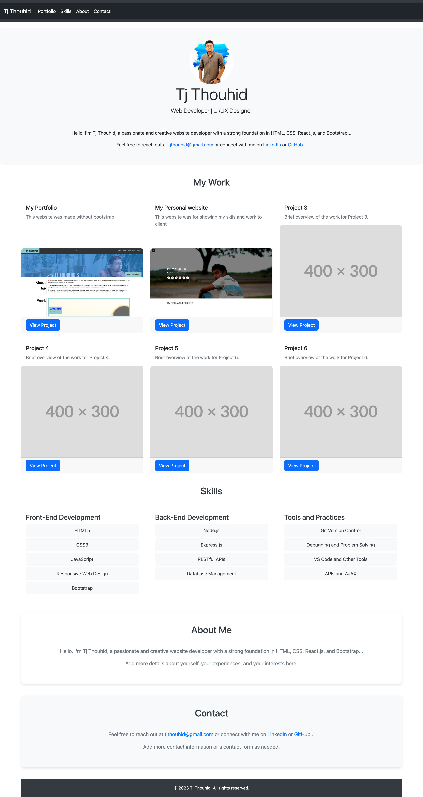

# Tj Thouhid's Portfolio



## Description

Welcome to my personal portfolio website! This project showcases my skills, projects, and experiences as a web developer and UI/UX designer. It is designed to provide visitors with an overview of who I am and the work I've done.

## Live Site

Explore the live site: [Tj Thouhid's Portfolio](https://edxbootcamp.github.io/Bootstrap-Portfolio/)

## Table of Contents

- [Features](#features)
- [Getting Started](#getting-started)
- [Usage](#usage)
- [Technologies](#technologies)
- [Contributing](#contributing)
- [License](#license)

## Features

- **Navigation:** Easy navigation through the navbar to sections such as About Me, Portfolio, Skills, and Contact.
- **Portfolio Section:** Displays a collection of my projects with project descriptions and links.
- **Skills Section:** Highlights my skills in front-end and back-end development, along with tools and practices.
- **About Me Section:** Provides a brief overview of who I am, my background, and interests.
- **Contact Section:** Offers various ways to get in touch, including email, LinkedIn, and GitHub.

## Getting Started

To view the portfolio locally, follow these steps:

1. Clone the repository:

   ```bash
   git clone https://github.com/EDXBootcamp/Bootstrap-Portfolio.git
   ```

2. Open the index.html file in a web browser.

## Usage

Feel free to customize the portfolio with your own content, projects, and details. Update the HTML, CSS, and images to reflect your personal brand.

## Technologies

- HTML5
- CSS3
- Bootstrap 5

## Contributing

If you find any issues or have suggestions for improvement, please open an issue or create a pull request. Contributions are welcome!

## License

This project is licensed under the MIT License.
